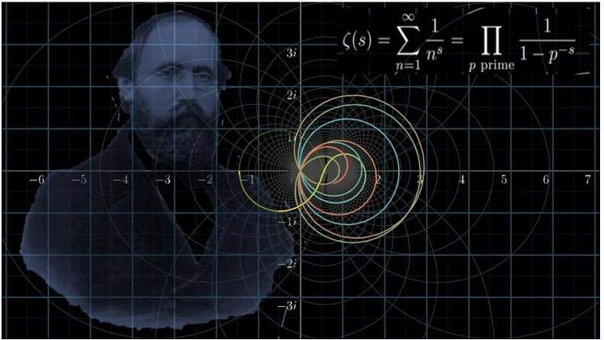

# Riemann Hypothesis – Tests and Proof Attempts

This repository contains various resources, experiments, and discussions related to the Riemann Hypothesis (RH). It includes numerical tests, theoretical explorations, and HTML files with proposed proofs or partial arguments, along with attached images and references.


## Contents

- **Appendix_RH.html**  
  An HTML document presenting a proposed argument or partial proof for the Riemann Hypothesis, accompanied by references and attachments.

- **Evidence of equivalent conditions for the Riemann Hypothesis.pdf**  
  A PDF outlining several equivalent statements and known results that relate to the Riemann Hypothesis.

- **Guy_Robin_index.py / Guy_Robin.py**  
  Python scripts exploring the Guy–Robin inequality, an approach sometimes used to test implications related to RH.

- **Riemann_final.py / Riemann_hypothesis_finaly.py / Riemann_hypothesis_i9.py**  
  Various Python programs performing numerical experiments, approximations, and checks that aim to shed light on the Riemann Hypothesis.

- **Additional Files (Attachments 1, 2, etc.)**  
  Supplementary data, references, or code snippets supporting the HTML documents and Python scripts.

## Highlights

- **Testing & Numerical Exploration**  
  Multiple scripts allow you to experiment with zero-finding, inequalities, and other numerical aspects that might offer insights into the Riemann Hypothesis.

- **Proof Drafts & References**  
  The HTML file(s) (e.g., `Appendix_RH.html`) and PDF references contain attempts or outlines of proof strategies, along with known equivalent statements and supportive arguments.  

## Usage

1. **Clone the Repository**  
   ```bash
   git clone https://github.com/yourusername/Riemann-hypothesis.git
